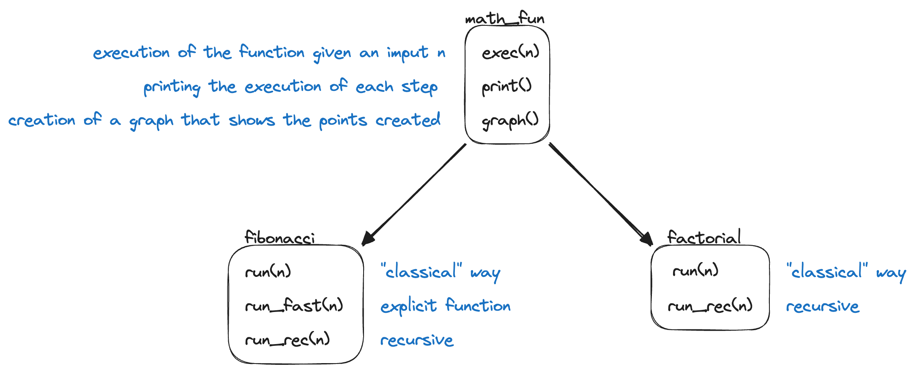

# mathematical_function
Is the implementation of an abstract class that implements 2 functions:
- Fibonacci
- Factorial

## How to set up?
There is a main abstract class that is implemented by the classes fibonacci and factorial.

To run the test use the command `poetry run pytest`